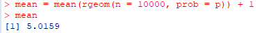
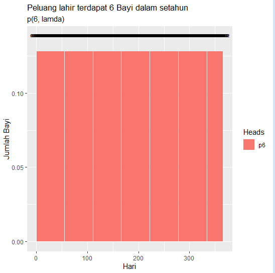

# P1_Probstat_A_05111840007002

## **1.Distribusi Geometrik**

**1.a**

**1.b**

**1.c**

**1.d**

**1.e**

**Rataan**

 bila dihitung secara langsung, rataan dengan p=0.2 adalah 1/p
 maka 1/0.2 = 5
 dengan n= 100000 maka dicari secara acak mean dengan R, dan didapatkan nilai yang mendekati

**Varians**

 bila dihitung manual, varian dari distribusi geometric adalah (1 - p) / p^2
 maka akan didaptkan var = 20
 dengan R, digunakan n=10000 dan didapatkan nilai yang mendekati

## **2.Distribusi Binomial**

**2.a**

**2.b**

**2.c**
**mean**

**varians**

## **3.Distribusi Poisson**

**3.a**

**3.b**

**3.c**

bila dibandingkan, dalam satu tahun, peluang muncul lahir 6 bayi adalah sama. yaitu p6 = 0.1281201. dengan kata lain peluang lahir dengan jumlah tertentu akan sama meski diulang berkali-kali. namun bila ditinjau ulang, maka kemungkinan lahir bayi setiap harinya akan berbeda. berikut merupakan histogram dari banyaknya bayi yang akan lahir setiap harinya dalam satu tahun

**3.d**

**mean**

**varians**

## **4.Distribusi Chi-Square**

**4.a**

**4.b**

**4.c**
**rataan**

rataan dari chi-square sama dengan nilai kebebasan nya sehingga rataan dari chi-square = v.

**varians**

varian dari chi-square adalah 2 kali rataan/derajat kebebasan. sehingga varian dari chi-square = 2*v

